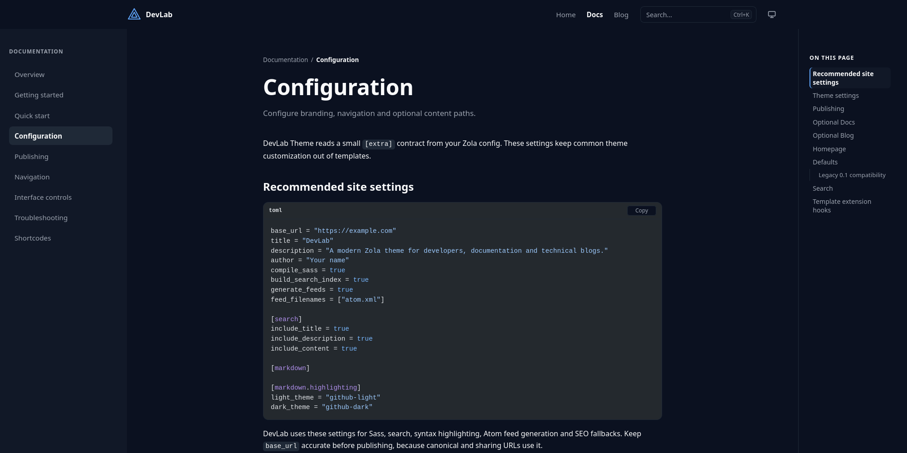

+++
title = "devlab-theme"
description = "A Zola-native theme for documentation, release updates and developer sites."
template = "theme.html"
date = 2026-07-13T04:07:45+05:00

[taxonomies]
theme-tags = ['documentation', 'blog', 'responsive', 'search', 'dark-mode']

[extra]
created = 2026-07-13T04:07:45+05:00
updated = 2026-07-13T04:07:45+05:00
repository = "https://codeberg.org/ripetitor/devlab-theme.git"
homepage = "https://codeberg.org/RiPetitor/devlab-theme"
minimum_version = "0.22.0"
license = "MIT"
demo = "https://ripetitor.codeberg.page/devlab-theme/"

[extra.author]
name = "RiPetitor"
homepage = "https://codeberg.org/RiPetitor"
+++        


# DevLab Theme

DevLab is a Zola-native theme for documentation, release updates and developer sites. It combines a calm responsive interface with recursive Docs navigation, Blog-based updates and a small vanilla JavaScript runtime—without npm or a frontend build step.



[Live demo](https://ripetitor.codeberg.page/devlab-theme/) · [Documentation](https://ripetitor.codeberg.page/devlab-theme/docs/) · [Updates](https://ripetitor.codeberg.page/devlab-theme/blog/)

## Features

- Full-height Docs sidebar, breadcrumbs, table of contents and server-rendered previous/next links
- Nested documentation sections generated from the Zola content tree
- Paginated Blog/Updates with published, updated and release metadata
- Accessible search, mobile drawer, skip navigation and Copy feedback
- Light, dark and system color modes with reduced-motion support
- Structured `extra.devlab` configuration with `0.1.x` compatibility
- Template hooks for custom metadata, styles, scripts and body integrations
- SEO metadata, Atom feed discovery, custom 404 and SVG favicon
- Callout, card and icon shortcodes plus an optional Downloads layout

## Install

Clone the theme into an existing Zola site:

```sh
git clone https://codeberg.org/RiPetitor/devlab-theme themes/devlab-theme
```

Enable it in `zola.toml`:

```toml
base_url = "https://example.com"
title = "My project"
theme = "devlab-theme"

compile_sass = true
build_search_index = true

[search]
include_title = true
include_description = true
include_content = true

[extra.devlab.appearance]
default_mode = "system"
show_toggle = true
```

Create `content/_index.md`, then run:

```sh
zola serve
```

Docs, Blog and richer homepage sections are opt-in. The complete setup, structured configuration and migration aliases are maintained in the [live documentation](https://ripetitor.codeberg.page/devlab-theme/docs/).

## Compatibility

- Zola `0.22.0` or newer
- No Node.js, npm or external frontend runtime required
- Flat `0.1.x` configuration fields remain supported in `0.2.0`

## Development

This repository contains both the reusable theme and its Demo/Docs site. Blog serves as the human-readable release history.

```sh
zola check
zola build
```

## License

MIT

        