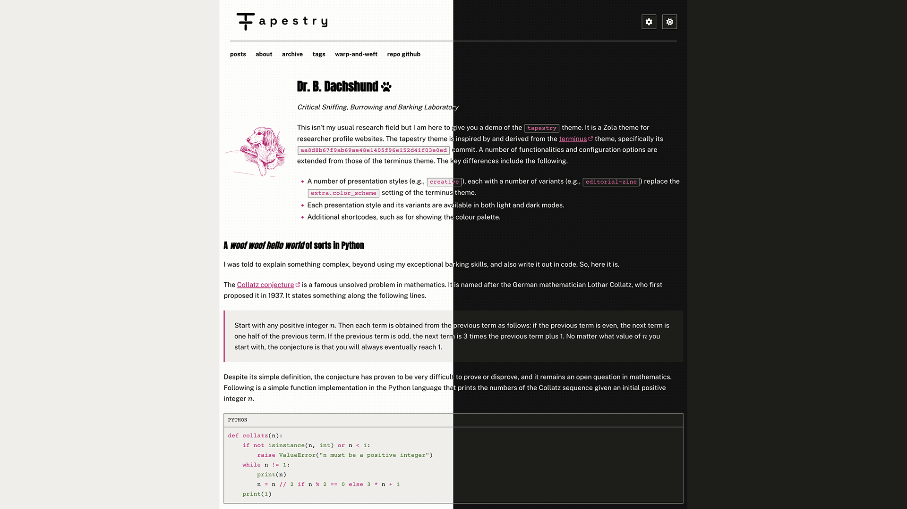

+++
title = "tapestry"
description = "A Zola theme for academic and industry researcher profile websites, derived from and backward-compatible with terminus"
template = "theme.html"
date = 2026-07-17T01:56:44Z

[taxonomies]
theme-tags = ['scholarly', 'academic', 'portfolio', 'blog', 'minimal', 'personal', 'responsive', 'seo']

[extra]
created = 2026-07-17T01:56:44Z
updated = 2026-07-17T01:56:44Z
repository = "https://github.com/anirbanbasu/tapestry.git"
homepage = "https://github.com/anirbanbasu/tapestry"
minimum_version = "0.22.0"
license = "MIT"
demo = "https://ghp-tapestry.anirbanbasu.com"

[extra.author]
name = "Anirban Basu"
homepage = "https://www.anirbanbasu.com"
+++        

# Tapestry

Tapestry is a researcher profile website theme for the [Zola static site generator](https://www.getzola.org/).

Inspired by and derived from the [terminus theme](https://github.com/ebkalderon/terminus), specifically its `aa8d8b67f9ab69ae48e1405f96e152d41f03e0ed` commit, tapestry inherits a number of features from the terminus theme. The key differences include the following.

- Five presentation style groups — `scholarly`, `creative`, `natural`, `precision`, and `collective` — each with a number of variants (e.g., `creative`'s `editorial-zine`) replace the `extra.color_scheme` setting of the terminus theme.
- Each presentation style and its variants are available in both light and dark modes.
- Additional shortcodes, such as for showing the colour palette.

Try the demo at the following links.

- [https://ghp-tapestry.netlify.app](https://ghp-tapestry.netlify.app)
- [https://ghp-tapestry.anirbanbasu.com](https://ghp-tapestry.anirbanbasu.com)



## Features

- **Five presentation style groups** — `scholarly`, `creative`, `natural`,
  `precision`, and `collective` — each offering multiple fully-specified
  variants (distinct typefaces, colour palettes, and layout treatments), all
  with matching light and dark modes.
- **WCAG 2.1 Level AA accessibility** across every shipped template and
  style/variant combination — colour contrast, keyboard navigation,
  semantic landmarks, visible focus states.
- Practically **no JavaScript**: only a light/dark theme switcher, optional
  client-side KaTeX math rendering, and an optional presentation
  style/variant switcher — nothing else, no analytics, no third-party
  embeds.
- **Self-hosted fonts** — no runtime calls to Google Fonts or any other
  font CDN.
- A 12-column responsive grid, GitHub-style Markdown alerts, and a set of
  extra shortcodes (e.g. a colour palette preview) on top of everything
  inherited from terminus.

## Requirements

- [Zola](https://www.getzola.org/) `0.22.1` or newer (the theme's own
  `theme.toml` pins `min_version = "0.22.0"`).

## Usage

1. Initialise a Git repository in your [Zola project directory](https://www.getzola.org/documentation/getting-started/cli-usage/#init), if you have not done it.

   ```bash
   git init
   ```

2. Add this theme as a Git submodule.

   ```bash
   git submodule add https://github.com/anirbanbasu/tapestry.git themes/tapestry
   ```

3. Enable this theme in your `config.toml`:

   ```toml
   theme = "tapestry"
   ```

4. Set a website `title` of your liking in your  `config.toml`:

   ```toml
   title = "My research profile"
   ```

5. Create a text file named `content/_index.md`. This file controls how your home page looks. Choose _exactly one_ of the following options:

   1. **Serve yours posts from `/`:**

      ```markdown
      +++
      title = "Home"
      paginate_by = 5  # Show 5 posts per page.
      +++
      ```

   2. **Serve posts from a different path, e.g. `posts/`:**

      ```markdown
      +++
      title = "Home"

      [extra]
      section_path = "posts/_index.md"  # Where to find your posts.
      max_posts = 5  # Show 5 posts and a link to posts section on home page.
      +++
      ```

## Configuration

Beyond the homepage setup above, Tapestry reads a range of `extra.*` keys at
the site, section, and page level — presentation style/variant selection,
KaTeX, social/navigation links, image handling, content security policy,
and more. Rather than duplicate that reference here, consult the live,
always-up-to-date documentation on either demo site:

- [https://ghp-tapestry.anirbanbasu.com/docs](https://ghp-tapestry.anirbanbasu.com/docs)
- [https://ghp-tapestry.netlify.app/docs](https://ghp-tapestry.netlify.app/docs)

## Contributing

Contributions to this theme are very welcome! However, if you want to contribute to the theme, please do so at the [theme-tapestry-dev](https://github.com/anirbanbasu/theme-tapestry-dev) repository. Meanwhile, this repository exists only to serve the purpose of a Git submodule installable theme for your Zola project.

## License

This project is licensed under the terms of the [MIT license](LICENSE).

        