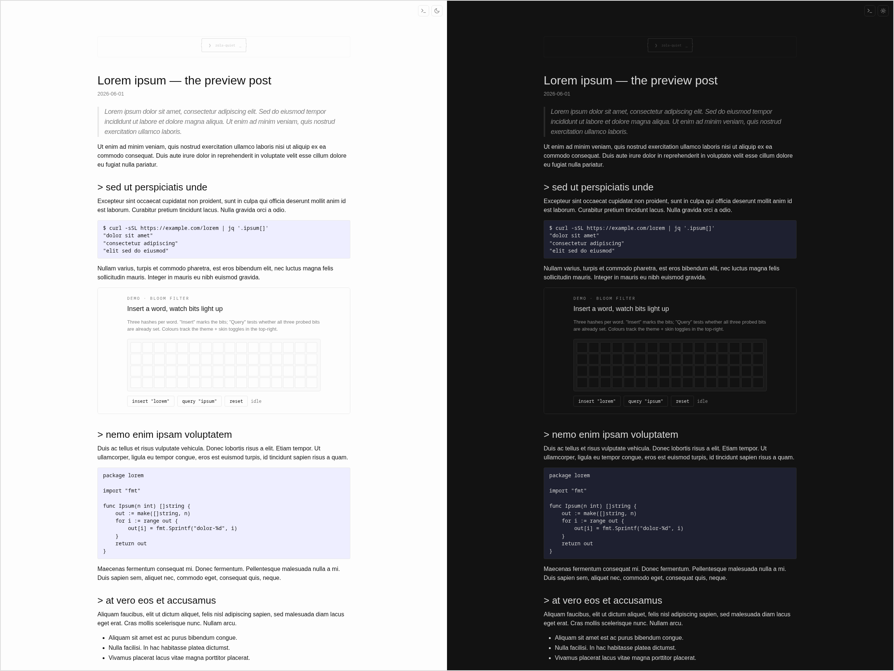

+++
title = "zola-quiet"
description = "A quiet, two-skin Zola theme: Minima-flavoured typography and a TUI/ncurses look with ASCII article frame. Both skins ship with matched light and dark modes plus a runtime toggle. Docs-style on-page TOC, addendum convention, iframe theme-sync protocol baked in."
template = "theme.html"
date = 2026-07-12T11:59:15+05:30

[taxonomies]
theme-tags = []

[extra]
created = 2026-07-12T11:59:15+05:30
updated = 2026-07-12T11:59:15+05:30
repository = "https://github.com/johnnybravo-xyz/zola-quiet.git"
homepage = "https://github.com/johnnybravo-xyz/zola-quiet"
minimum_version = "0.19.0"
license = "MIT"
demo = ""

[extra.author]
name = "Ritesh Shrivastav"
homepage = "https://johnnybravo.xyz"
+++        

# zola-quiet

A quiet, two-skin Zola theme. Two stylesheets ship together — a
Minima-flavoured typographic skin and a TUI/ncurses skin with an
ASCII-drawn article frame. Both ship with matched light and dark
modes, and two runtime toggles in the top-right flip between them
(skin + light/dark). Both choices persist to `localStorage`. Posts
with headings get a docs-style "on this page" TOC pinned under the
sidebar on the TUI skin, with scroll-spy for the active section.

No frameworks, no fonts hot-linked from a CDN, no analytics, no
search, no comments. Static HTML out of Zola, two CSS files, two
tiny inline scripts.

## Screenshots

Each skin is shown with its light mode on the left and dark mode
on the right, rendered from the built-in `lorem-preview` sample
post via [`scripts/screenshots.sh`](scripts/screenshots.sh).

Minima skin (the default):



TUI/ncurses skin with ASCII article frame and on-page TOC:


## What you get

- **Two skins, both with matched light + dark modes.**
  `style.css` is the default (Minima-flavoured — system sans,
  ~740 px column, weight-400 headings, blue links).
  `style-tui.css` is the TUI/ncurses look (monospace everywhere,
  ASCII article frame, `-rw-r--r--` post list, sticky sidebar,
  warm-paper light / near-black dark palette).
- **Light/dark toggle.** Sun/moon icon, system-preference default,
  flash-free on cold loads (the choice is applied to `<html>`
  before the stylesheet is fetched). Both skins define both
  palettes; nothing to opt into.
- **Skin toggle.** Type/terminal glyph next to the theme toggle.
  Click to flip stylesheets at runtime — no rebuild.
- **On-page TOC.** Set `insert_anchor_links = "left"` on a section
  or page and posts with headings get a sticky "on this page" nav
  pinned under the sidebar on the TUI skin. Scroll-spy highlights
  the active heading.
- **Addendum convention.** `<div class="addendum">` for adding
  dated extensions to posts after their original publish date.
  Visible eyebrow, left rule, tinted background, dark-mode aware.
- **xkcd shortcode.** `{{/* xkcd(num=…, title=…, alt=…) */}}` renders a
  `<figure class="xkcd">` with CC BY-NC 2.5 attribution.
- **Visualiser iframe helpers.** Drop-in scripts under
  `/visualizers/_shared/` handle the theme-sync `postMessage`
  protocol so any iframe wires up in a couple of lines instead of
  hand-rolling the listener each time. See
  _Embedding a visualiser_ below.
- **Theme-aware syntax highlighting.** Opt-in: enable Zola's
  class-mode highlighting and pick a light/dark theme pair; the
  base template loads both `giallo-*.css` files and flips them in
  step with the toggle. See _Syntax highlighting_ below.
- **Tag chips, post-meta, atom feed, sitemap, 404 page.** All the
  Zola defaults wired to the theme styles.

## Install

```bash
cd your-site
git submodule add https://github.com/johnnybravo-xyz/zola-quiet themes/zola-quiet
```

Then in your `config.toml`:

```toml
theme = "zola-quiet"
```

## `[extra]` keys the templates read

All optional. Every block is ``-guarded so the theme
degrades cleanly if a key isn't set.

| Key                       | Used by               | Effect |
|---------------------------|-----------------------|--------|
| `extra.author`              | `<meta>`, footer line | "© YEAR <author>" |
| `extra.github`              | `index.html`, footer  | GitHub icon + connect link |
| `extra.linkedin`            | `index.html`, footer  | LinkedIn icon + connect link |
| `extra.email`               | `index.html`, footer  | Mail icon + connect link |
| `extra.ascii_signature`     | `base.html` sidebar   | Multi-line ASCII shown as a quiet signature above the content |
| `extra.homepage_post_limit` | `index.html`          | Cap the front-page post list to N most recent posts. When more exist, a "see all M posts →" link appears below the list. Unset or `0` shows every post. |

Example:

```toml
[extra]
author = "Jane Doe"
github = "janedoe"
linkedin = "janedoe"
email = "jane@example.com"
ascii_signature = """
░░░░░░░░░░░░
░░ HELLO  ░░
░░░░░░░░░░░░
"""
```

## Shareable heading anchors

The theme ships an `anchor-link.html` override that renders as a
dim `>` character before the heading text. To enable, set
`insert_anchor_links = "left"` in a page's frontmatter (or the
section's `_index.md`, where it applies as a default to all pages
in the section):

```toml
insert_anchor_links = "left"
```

Zola then inserts a `<a class="header-anchor" href="#slug">&gt;</a>`
before every `h2`/`h3`/etc. The CSS in `static/style.css` styles it
to look like a subtle prefix — dim by default, coloured on hover.

## Embedding a visualiser

If a post embeds an interactive visualiser as an iframe, the theme
ships two small helpers under `/visualizers/_shared/` so the plumbing
stays two `<script>` lines instead of a copy-pasted block.

**On the post side**, mark the iframe with `data-viz-embed` and give
it the height-message name the frame will post back:

```html
<iframe src="/visualizers/foo.html"
        title="Foo visualiser"
        loading="lazy"
        style="width:100%;height:800px;border:1px solid var(--rule);
               border-radius:6px;"
        data-viz-embed
        data-height-msg="foo-height"></iframe>
<script src="/visualizers/_shared/viz-embed.js" defer></script>
```

`viz-embed.js` finds every `iframe[data-viz-embed]` on the page, sends
`{theme, skin}` to it on load and whenever the parent's `data-theme` or
`data-skin` change, and resizes the iframe when the frame posts a
height back.

**Inside the visualiser HTML**, load the frame-side helper (plus the
optional TUI palette so the viz tracks the skin toggle):

```html
<link rel="stylesheet" href="/visualizers/_shared/viz-tui.css">
<script src="/visualizers/_shared/viz-frame.js"
        data-height-msg="foo-height"
        data-size-selector=".wrap"
        defer></script>
```

`viz-frame.js` mirrors `data-theme` / `data-skin` onto the frame's own
`<html>` when it receives them, and posts the `.wrap` element's height
back to the parent (change the selector via `data-size-selector`).
Omit `data-height-msg` to skip height reporting entirely.

`viz-tui.css` sets base CSS variables (`--bg`, `--panel`, `--text`,
`--mark`, `--match`, `--danger`, etc.) for TUI light + dark. Each
visualiser stays free to add its own semantic aliases (e.g. `--go:
var(--mark);`) — the file only overrides when `data-skin="tui"` is on
the frame root.

## Syntax highlighting

The theme is wired for Zola 0.22+ class-mode syntax highlighting,
but doesn't enable it for you — you opt in from your site's
`config.toml`. When you do, the base template loads two CSS files
(`/giallo-light.css` and `/giallo-dark.css`) with media-query
gating, and the theme toggle flips them in step with the light/dark
toggle.

To enable, add this to your site's `config.toml`:

```toml
[markdown.highlighting]
style = "class"
light_theme = "github-light"
dark_theme = "github-dark"
```

Zola emits the two CSS files automatically on the next build. The
filenames (`giallo-light.css` and `giallo-dark.css`) are fixed by
Zola — don't rename them; the theme's `<link>` tags expect those
exact paths.

The theme names come from
[shikijs/textmate-grammars-themes](https://github.com/shikijs/textmate-grammars-themes/tree/main/packages/tm-themes/themes)
(VSCode-flavoured TextMate themes that Zola 0.22+ bundles via the
`giallo` highlighter). Any matched light/dark pair works — common
choices are `github-light`/`github-dark`, `one-light`/`one-dark-pro`,
`ayu-light`/`ayu-dark`, `everforest-light`/`everforest-dark`.

If you'd rather _not_ have syntax highlighting, simply omit the
`[markdown.highlighting]` block; the `<link>` tags will 404 on
those two files but the rest of the site is unaffected. (Or fork
the base template and drop the two lines.)

## Templates you can override

Drop a file with the same name into your site's `templates/` to
override the theme's. The theme ships:

- `base.html` — page chrome, toggles, controls, footer
- `index.html` — homepage (post list + connect block)
- `section.html` — post list pages (e.g. `/posts/`)
- `page.html` — individual posts with date + tag chips
- `taxonomy_list.html` — `/tags/`
- `taxonomy_single.html` — `/tags/foo/`
- `shortcodes/xkcd.html` — comic embed shortcode

## CSS conventions

Useful classes the stylesheets style:

- `pre.whoami` — borderless monospace block, no background; good for
  a `$ whoami` opener on the homepage.
- `.post-list` — un-bulleted post list with `<time>` prefix.
- `.tag-chip` — rounded pill rendered for each tag.
- `figure.xkcd` — bordered comic figure with attribution caption.
- `.addendum`, `.addendum-eyebrow` — the dated-extension block.
- `.controls`, `.skin-toggle`, `.theme-toggle` — top-right toggle pair.

## Run the demo

```bash
git clone https://github.com/johnnybravo-xyz/zola-quiet
cd zola-quiet
zola serve
```

`config.toml` at the repo root is a minimal demo configuration
that's only used when building this repo in isolation.

## License

MIT — see `LICENSE`.

        