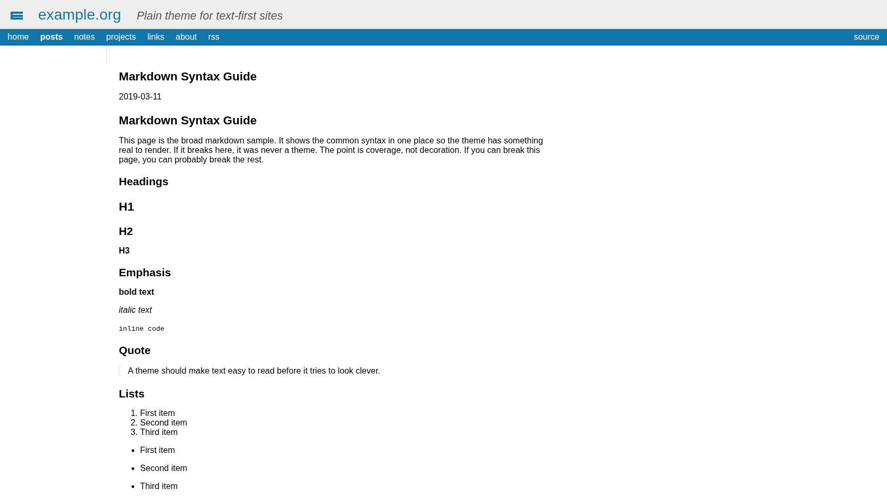

+++
title = "Suckless"
description = "A minimal Zola theme with fixed structure, configurable navigation, and a focus on content over decoration."
template = "theme.html"
date = 2026-06-25T23:10:21-05:00

[taxonomies]
theme-tags = ['blog', 'minimal', 'theme', 'plain']

[extra]
created = 2026-06-25T23:10:21-05:00
updated = 2026-06-25T23:10:21-05:00
repository = "https://github.com/enzv/zola-suckless-theme.git"
homepage = "https://github.com/enzv/zola-suckless-theme"
minimum_version = "0.22.0"
license = "MIT"
demo = ""

[extra.author]
name = "Enzo Venturi"
homepage = "https://enzoventuri.com"
+++        

# Suckless

This is a plain Zola theme.

It is fast, text-first, dependency-light, and openly hostile to ornamental nonsense.  
No JavaScript. No remote fonts. No decorative sludge pretending to be craft.

If you need gradients, hero banners, floating glass panels, scroll theatrics, or some fragile little front-end shrine to your own taste, use another theme and leave this one alone.



## Contents

- Installation
- Development
- Options
- Expected content structure
- Shortcodes
- What this theme is

## Installation

Put the theme in your site's `themes/` directory:

```sh
cd themes
git clone https://github.com/enzv/zola-suckless-theme.git suckless
```

Then enable it in your site's `zola.toml`:

```toml
theme = "suckless"
```

That is the whole installation story. It is a theme, not a lifestyle.

This repository also includes a root `zola.toml` plus sample content so the theme can be developed and previewed directly.

## Development

Run the demo site:

```sh
zola serve
```

Check that the content and templates are sane:

```sh
zola check
```

Build the site:

```sh
zola build
```

If this repo stops building, the problem is not hiding inside a circus of bundlers, loaders, transpilers, and post-whatever ceremony. It is in the content, the config, or the templates. Good. That means you can actually find it.

## Options

All theme settings live under `[extra]`.

```toml
[extra]
brand_name = "example.org"
brand_href = "/"
brand_logo_src = ""
brand_logo_alt = ""
archive_section_path = "posts/_index.md"
archive_base_url = "/posts/"

utility_nav = [
  { text = "source", href = "https://example.org/source" },
]

primary_nav = [
  {
    text = "home",
    href = "/",
    secondary_nav = [
      { text = "about", href = "/about/" },
      { text = "contact", href = "/contact/" },
    ],
  },
  { text = "posts", href = "/posts/" },
  { text = "notes", href = "/notes/" },
]
```

### Brand

- `brand_name`: text shown in the header. If omitted, the theme falls back to `config.title`.
- `brand_href`: link target for the site title and optional logo.
- `brand_logo_src`: optional logo path. Leave it empty if you do not want a logo.
- `brand_logo_alt`: alt text for the logo image.

### Navigation

- `primary_nav`: the main navigation in the top bar.
- `secondary_nav`: optional nested links for a primary navigation item. These render in the sidebar on desktop and in the section strip on mobile.
- `utility_nav`: optional links aligned to the right on desktop and moved to the footer on mobile.

Every navigation item needs `text` and `href`. That is it. No magic menu builder. No fake intelligence. No guessing what your site meant to be.

### Archive section

- `archive_section_path`: section path used for year-based archive navigation. Default: `posts/_index.md`.
- `archive_base_url`: URL prefix used to decide when the year archive should appear. Default: `/posts/`.

If your archive section is not `/posts/`, change both values. If you do not have an archive section, do not cosplay as a publication.

## Expected content structure

The theme works best when the site has:

- a text-oriented home page
- one archive-like section such as `/posts/`
- a `tags` taxonomy if you want tag links on pages
- navigation defined explicitly in `[extra.primary_nav]`

The theme does not auto-generate navigation from sections because auto-generated navigation usually turns into lazy clutter dressed up as convenience.

## Shortcodes

The theme ships with a small set of shortcodes and stops there:

- `audio(src, mime?, fallback?, caption?)`
- `video(src, mime?, fallback?, caption?)`
- `figure(src, alt?, title?, loading?, caption?)`
- `quote(text, author?, cite?, source?)`
- `details(summary, text, open?)`
- `sub(body)`
- `sup(body)`

See [`content/posts/2017-03-11-shortcodes-and-media.md`](./content/posts/2017-03-11-shortcodes-and-media.md) for examples.

## What this theme is

- Lightweight. It loads fast because it has almost nothing to hide behind.
- Responsive. It works on narrow and wide screens without turning the layout into a performance tax.
- Accessible by default. It uses semantic templates, plain navigation, real headings, and ordinary links.
- Local. CSS and assets live in the repo. The theme does not phone home for fonts, scripts, or vanity.
- Manual on purpose. You decide the navigation structure instead of delegating it to a half-smart abstraction.

`theme.toml` includes default `extra` values so the theme can boot with minimal setup, but any real site should override them immediately. If you ship the defaults unchanged, that is on you.

        